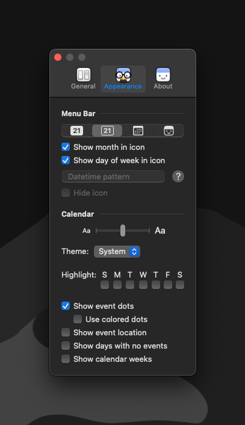
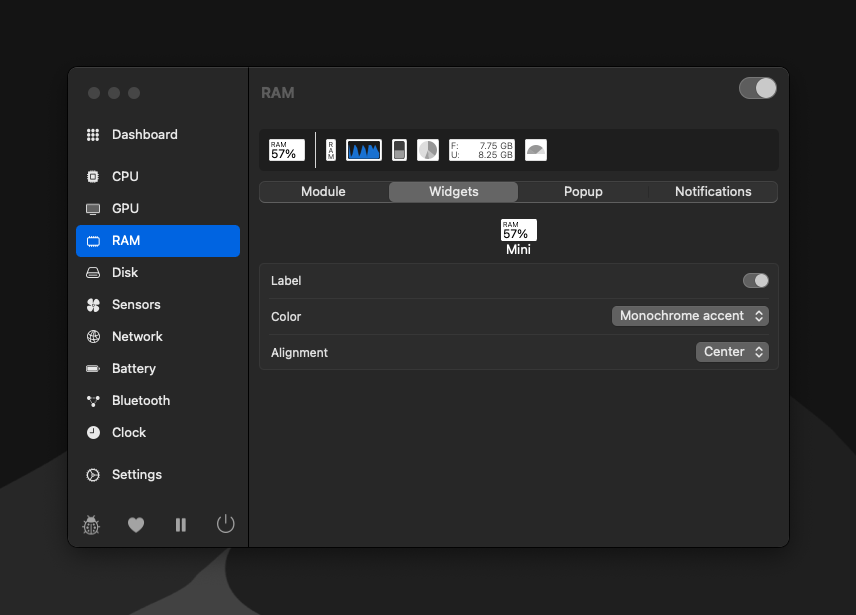
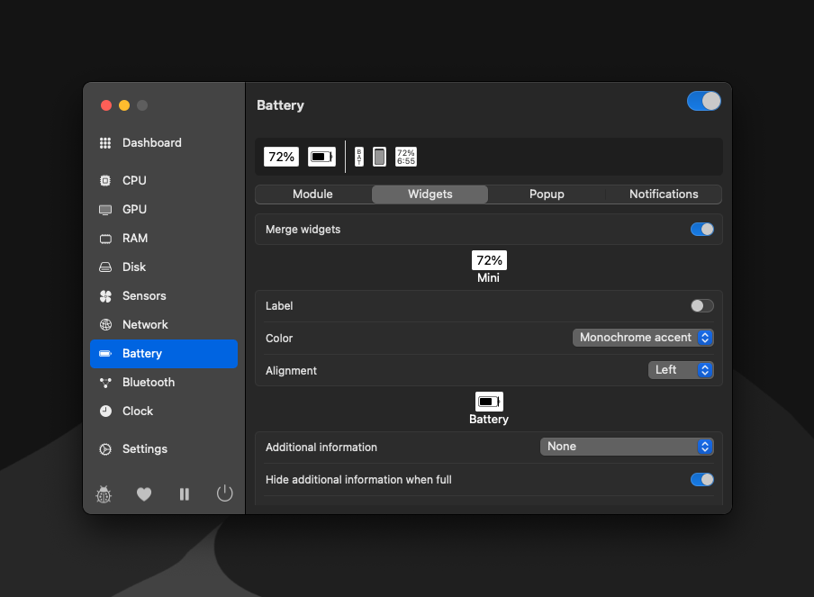
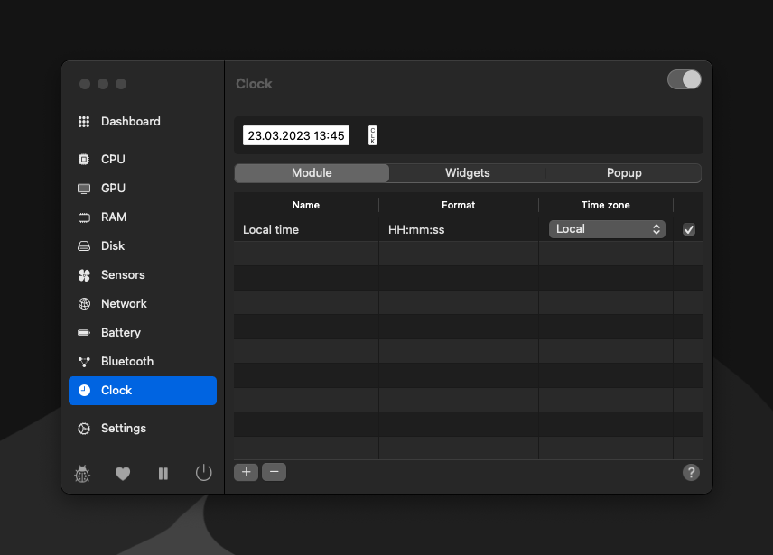
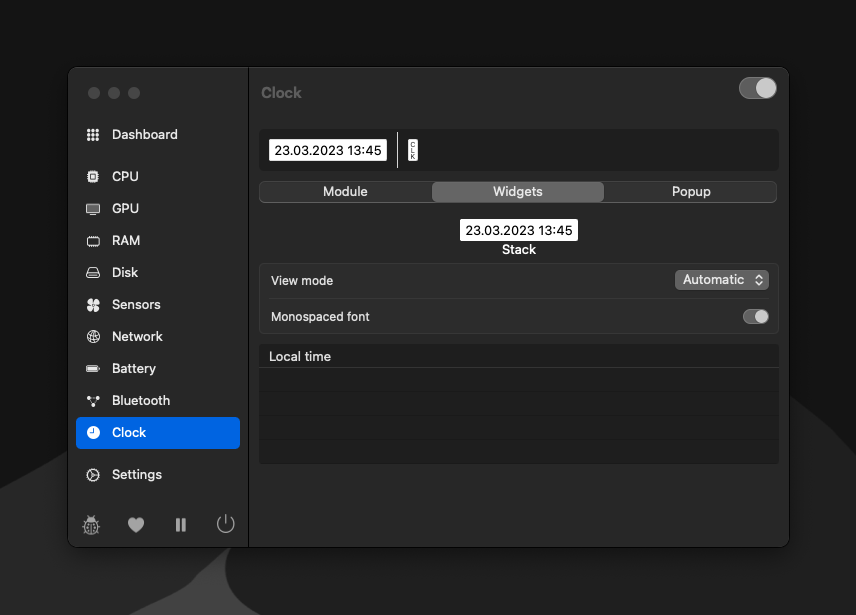
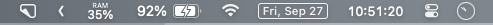

## My Mac Setup

This repo contains info on all the apps / tools / settings I use on my Mac.

<!-- START doctoc generated TOC please keep comment here to allow auto update -->
<!-- DON'T EDIT THIS SECTION, INSTEAD RE-RUN doctoc TO UPDATE -->


- [My Mac Setup](#my-mac-setup)
- [What MacBook do I have?](#what-macbook-do-i-have)
- [OS Settings](#os-settings)
  - [Desktop](#desktop)
  - [Finder](#finder)
  - [Dock](#dock)
- [Github](#github)
  - [Github SSH Setup](#github-ssh-setup)
- [Homebrew](#homebrew)
- [Quick Launching](#quick-launching)
  - [RayCast](#raycast)
    - [RayCast Plugins](#raycast-plugins)
- [Window Management](#window-management)
- [App Switching](#app-switching)
- [Menu Bar Utilities](#menu-bar-utilities)
  - [Hidden Bar](#hidden-bar)
  - [itsycal](#itsycal)
  - [stats](#stats)
    - [Settings to turn off:](#settings-to-turn-off)
    - [RAM settings](#ram-settings)
    - [Battery percentage settings](#battery-percentage-settings)
    - [Clock settings](#clock-settings)
  - [Re-arrange menu bar to look like this](#re-arrange-menu-bar-to-look-like-this)
- [Web Browser](#web-browser)
  - [Arc](#arc)
  - [Firefox](#firefox)
- [Fonts I use](#fonts-i-use)
- [Other Apps I Use Daily](#other-apps-i-use-daily)
- [Other Command Line Tools I Use Daily](#other-command-line-tools-i-use-daily)
- [Other APPS (Not available in homebrew)](#other-apps-not-available-in-homebrew)
  - [Setapp](#setapp)
      - [Apps to install](#apps-to-install)
  - [Docker](#docker)
- [Terminal](#terminal)
  - [Shell](#shell)
    - [Load dotfiles](#load-dotfiles)
- [Node.js](#nodejs)
  - [Global Modules](#global-modules)

<!-- END doctoc generated TOC please keep comment here to allow auto update -->

## What MacBook do I have?

I am using a 2021 16" MacBook Pro

The specs:

- Apple M1 Pro Max
- 64GB RAM
- 2TB SSD

Read more about my MacBook [here](https://everymac.com/systems/apple/macbook_pro/specs/macbook-pro-m1-max-10-core-cpu-24-core-gpu-16-2021-specs.html).

## OS Settings

These are my preferred settings for `Desktop`, `Finder` and the `Dock`.

### Desktop

I don't like the new Desktop, Stage Manager or Widget features in Sequoia, so I disable them.

- System Preferences
  - Control Center
    - Other Modules
      - Battery
        - Show in menu bar -> uncheck
        - Show in control center -> uncheck
        - Show percentage -> uncheck
  - Desktop & Dock
    - Desktop & Stage Manager
      - Show Items
        - On Desktop -> uncheck
        - In Stage Manager -> uncheck
      - Click wallpaper to reveal desktop -> Only in Stage Manager
      - Stage Manager -> uncheck
      - Widgets
        - On Desktop -> uncheck
        - In Stage Manager -> uncheck
      - Windows
        - Prefer tabs when opening document -> In Full Screen
        - Ask to keep changes when closing documents -> uncheck
        - Tile by dragging window to screen edges -> uncheck
        - hold option key while dragging windows to tile -> uncheck
        - tiled windows have margins -> uncheck
  - General
    - AutoFill & Passwords
      - AutoFill Passwords and Passkeys -> uncheck
  - Trackpad
    - Scroll & Zoom
      - Natural Scrolling -> uncheck
    - Menu Bar Only
      - Clock
        - Clock Options...
          - Date
            - Show date -> Never
            - Show day of the week -> uncheck
          - Time
            - Style -> Analog
            - Show AM/PM -> uncheck
            - Flash the time separators -> uncheck
            - Display the time with seconds -> uncheck
      - Spotlight -> Don't show in Menu Bar
      - Siri -> Don't show in Menu Bar
      - TIme Machine -> Don't show in Menu Bar

### Finder

- Finder -> Preferences
  - General -> Show these on the desktop -> Select None
    - I try to keep my desktop completely clean.
  - General -> New Finder windows show -> Home Folder
    - I prefer to see my home folder in each new finder window instead of recent documents
  - Advanced -> Show all filename extensions -> Yes
  - Advanced -> Show warning before changing an extension -> No
  - Advanced -> When performing a search -> Search the current folder
- View
  - Show Status Bar
  - Show Path Bar
  - Show Tab Bar

### Dock

I don't use the Dock at all. It takes up screen space, and I can use RayCast to launch apps and AltTab to switch between apps. I make the dock as small as possible and auto hide it.

- System Preferences
  - Desktop & Dock
    - Size -> Small as possible
    - Position on screen -> Bottom
    - Automatically hide and show the Dock -> Yes
    - Animate opening applications -> No
    - Show suggested and recent apps in the Dock -> No

## Github

I like to setup github at this point so I can clone this repo to access `.txt` files for easy batch installs later in this guide.

### Github SSH Setup

- Follow [this guide](https://docs.github.com/en/authentication/connecting-to-github-with-ssh/generating-a-new-ssh-key-and-adding-it-to-the-ssh-agent) to setup an ssh key for github
- Follow [this guide](https://docs.github.com/en/authentication/connecting-to-github-with-ssh/adding-a-new-ssh-key-to-your-github-account) to add the ssh key to your github account
- Follow [this guide](https://docs.github.com/en/authentication/connecting-to-github-with-ssh/testing-your-ssh-connection) to test the ssh connection

## Homebrew

[Homebrew](https://brew.sh/) allows us to install tools and apps from the command line.

To install it, open up the built in `Terminal` app and run this command:

```sh
/bin/bash -c "$(curl -fsSL https://raw.githubusercontent.com/Homebrew/install/HEAD/install.sh)"
```

This will also install the xcode build tools which is needed by many other developer tools.

After Homebrew is done installing, we will use it (via RayCast) to install everything else we need.

## Quick Launching

### RayCast

The built in spotlight search is a bit slow for me and usually has web search results as the default instead of apps or folders on my machine.

I use [RayCast](https://www.raycast.com/).

```sh
brew install raycast
```

#### RayCast Plugins

- [1Password](https://www.raycast.com/khasbilegt/1password)
- [iMessage 2FA](https://www.raycast.com/yuercl/imessage-2fa)
- [RayCast Homebrew Plugin](https://www.raycast.com/nhojb/brew) so we can easily install formulae and casks directly from RayCast.

## Window Management

RayCast has this feature built in, So here are the settings to make it work:


## App Switching

The built in App switcher only shows application icons, and only shows 1 icon per app regardless of how many windows you have open in that app.

I use an app switcher called [AltTab](https://alt-tab-macos.netlify.app/). It shows full window previews, and has an option to show a preview for every open window in all applications (even minimized ones).

I replace the built-in `CMD+TAB` shortcut with AltTab.

Search for `alt-tab` in RayCast `brew search` or:

```sh
brew install alt-tab
```

## Menu Bar Utilities

### Hidden Bar

If you have several apps running that have menu bar icons, [Hidden Bar](https://github.com/dwarvesf/hidden) will let you choose which ones should be hidden after a timeout. This cleans things up if you have a ton of background apps running.

Search for `hiddenbar` in RayCast `brew search` or:

```sh
brew install hiddenbar
```

### itsycal

Simple calendar app that show date and a dropdown with events

```sh
brew install itsycal
```



### stats

Simple stats app that I use to show memory usage, and customize the time and battery percentage displayed.

```sh
brew install stats
```

#### Settings to turn off:

- CPU
- GPU
- Disk
- Sensors
- Network
- Bluetooth

#### RAM settings



#### Battery percentage settings



#### Clock settings




### Re-arrange menu bar to look like this



## Web Browser

### Arc

I use [Arc](https://arc.net/) as my daily browser

I use the following extensions to stay productive:

- [1Password](https://chromewebstore.google.com/detail/1password-beta-%E2%80%93-password/khgocmkkpikpnmmkgmdnfckapcdkgfaf) - access 1password login info
- [Dark Reader](https://darkreader.org/) - turn any site into dark mode

### Firefox

I use Firefox because it is open source and comes from the [Mozilla Foundation](https://www.mozilla.org/en-US/about/manifesto/), a non profit company that [respects my privacy](https://www.mozilla.org/en-US/firefox/privacy/).

I use Firefox Developer Edition. To install this with `brew` you will need to install Firefox Developer Edition with brew:

```sh
brew install firefox@developer-edition
```

I use the following extensions to stay productive:

* [Tabliss](https://tabliss.io/) - simple new tab page
* [Dark Reader](https://darkreader.org/) - turn any site into dark mode

I use the following extensions to protect my privacy while browsing the web:

* Adblocker - [uBlock Origin](https://github.com/gorhill/uBlock)
* Tracker Blocker - [Privacy Badger](https://privacybadger.org/)
  * Firefox now includes tracker blocking, but I leave Privacy Badger enabled.
* [Decentraleyes](https://decentraleyes.org/)
  * Caches CDN links locally and intercepts requests to serve from the cache. Prevents CDNs from tracking you across websites.

## Fonts I use

One thing I love about homebrew is that I can use it to install fonts!

Place following in a .txt file and run brew install:

```
font-anonymous-pro
font-meslo-lg-nerd-font
```

```sh
xargs brew install < fonts.txt
```

## Other Apps I Use Daily

- [discord](https://discord.com/) - Messaging / Community
- [figma](https://www.figma.com/) - Image editor
- [keepingyouawake](https://keepingyouawake.app/) - Prevents my Mac from going to sleep when I'm presenting / live streaming
- [keka](https://www.keka.io/en/) - Can extract 7z / rar and other types of archives
- [visual-studio-code](https://code.visualstudio.com/) - Code Editor

You can install them in one go by placing them all into a text file and then running brew install:

```
cleanshot
discord
figma
gitkraken
iina
keepingyouawake
keka
notion
obs
obsidian
pika
postman
screen-studio
slack
visual-studio-code
zoom
```

```sh
xargs brew install < apps.txt
```

## Other Command Line Tools I Use Daily

You can install them in one go by placing them all into a text file and then running brew install:

```
eza
fzf
pnpm
powerlevel10k
speedtest-cli
stow
tldr
zoxide
```

```sh
xargs brew install < formulae.txt
```

## Other APPS (Not available in homebrew)

You can install the following from the MAC App Store

- 1Password for Safari
- Final Cut Pro
- Keynote
- Numbers
- Pixelmator Pro
- Speedtest
- Things

### Setapp

In a nutshell, beautifully. Setapp membership gives you access to curated apps for Mac, web and iOS for $9.99 / month. To install setapp:

```sh
brew install --cask setapp
```

##### Apps to install

- AirBUddy
- CleanMyMac X
- Downie
- MindNode

### Docker

There are multiple results when you search `docker` within `brew`. To install Docker desktop:

```sh
brew install --cask docker
```

## Terminal

I prefer [Wezterm](https://wezfurlong.org/wezterm/index.html) because:

- Simple lua configuration

Checkout their documentation for more info on what wezterm can do: [https://wezfurlong.org/wezterm/config/files.html](https://wezfurlong.org/wezterm/config/files.html)

```
brew install wezterm
```

### Shell

#### Load dotfiles

All my dotfiles are stored on [github](https://github.com/chris-nowicki/dotfiles).

I clone this repo to my machine and copy the files into my home directory.

## Node.js

I use nvm to manage the installed versions of Node.js on my machine. This allows me to easily switch between Node.js versions depending on the project I'm working in.

See installation instructions [here](https://github.com/nvm-sh/nvm#installing-and-updating).

OR run this command (make sure v0.39.7 is still the latest)

```sh
curl -o- https://raw.githubusercontent.com/nvm-sh/nvm/v0.39.7/install.sh | bash
```

Now that nvm is installed, you can install a specific version of node.js and use it:

```sh
nvm install 20
nvm use 20.10.0
node --version
```

### Global Modules

There are a few global node modules I use a lot:

- [npm-check-updates](https://www.npmjs.com/package/npm-check-updates)

```sh
npm install -g npm-check-updates
```

<!-- ## VS Code

VS Code is my preferred code editor.

You can view all of my VS Code settings / extensions [here](https://github.com/CodingGarden/vscode-settings). -->
